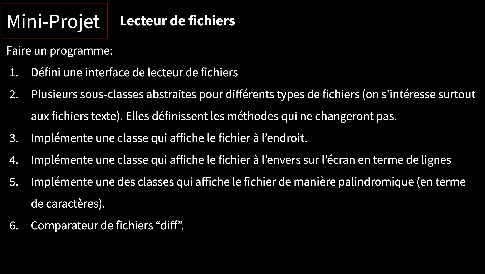

# Lecteurde fichiers en JAVA

Développer un lecteur de fichier et l'afficher de différente façon.

## Informations : 

- **Date :** 23/09/2021
- **Professeur :** Ninon DEVIS 
- **Développeur :** Noé PHILIPPE 

## Énoncé : 

